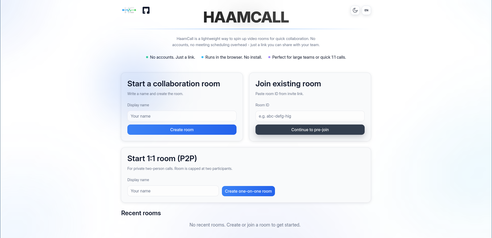
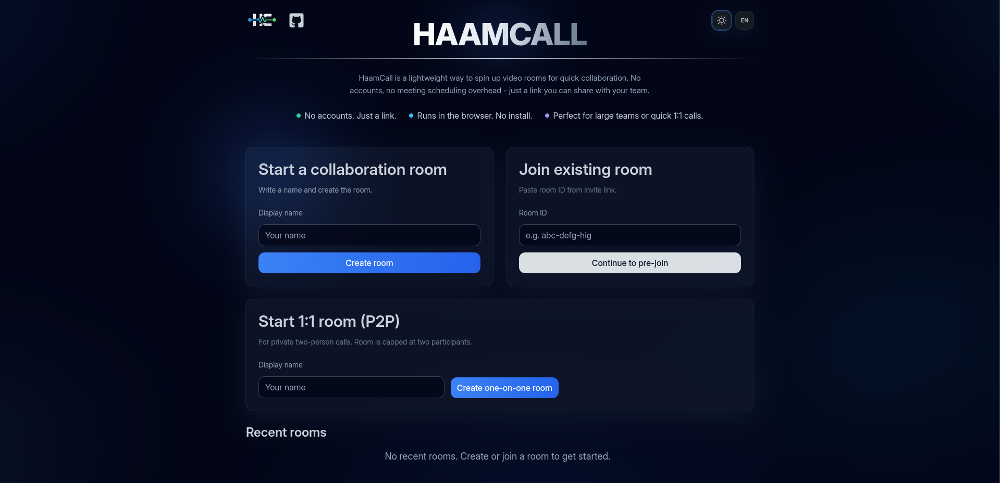

    

<h3 align="center">HaamCall v3</h3>
<h5 align="center">HaamCall v3 is a lightweight browser-based meeting app for fast team collaboration.</h5>

Language : [English](README.md) | [فارسی](README-fa.md)

---

## Table of Contents

- [Architecture](#architecture)
- [What Kind of Meetings You Can Have](#what-kind-of-meetings)
- [Key Features](#key-features)
- [Usage](#usage)
- [Project Evolution](#project-evolution)
- [Security](#security)
- [Tech Stack](#tech-stack)

## 🏗️ Architecture

HaamCall v3 introduces a **dynamic hybrid architecture** that intelligently adapts to meeting size for optimal performance:

- **1:1 Rooms** → Peer-to-Peer (P2P) connection for direct, low-latency communication
- **Group Rooms (3+ participants)** → SFU (Selective Forwarding Unit) via LiveKit for scalable media routing
- **File Sharing** → Handled via P2P for efficient, server-less file transfers

### 🎛️ Host Controls (v3)

Hosts have full control over meeting access:

- **Approve/Deny** join requests from users waiting to enter the meeting
- Real-time participant management directly from the meeting interface

### Backend Services

- Web app for meeting experience
- Backend service for room/session management
- LiveKit SFU for real-time audio/video/screen share transport

### 📈 Impact on Meeting Quality

- **Hybrid P2P+SFU approach** eliminates unnecessary server overhead for 1:1 calls while providing scalable group call performance
- **P2P file transfers** reduce server bandwidth costs and improve transfer speeds
- **Host approval system** gives meeting organizers full control over participant access
- **Adaptive video grid + active speaker highlighting** keeps focus clear in larger rooms
- **Reconnection handling + connection banners** improves reliability under unstable networks
- **TURN support** helps participants behind strict NAT/firewalls join more successfully
- **State isolation with Zustand stores** keeps room UI responsive and predictable during rapid media events

## 👥 What Kind of Meetings You Can Have

- **1:1 quick calls** for instant check-ins
- **Small team standups** with camera/mic and chat
- **Larger collaboration rooms** with adaptive participant layout
- **Presentation-style sessions** with screen sharing
- **Async-friendly sessions** using file upload/download and in-room chat

## ✨ Key Features

- Instant room creation + join by link
- No account required for regular meetings
- Pre-join camera/mic readiness check
- In-room controls: mic, camera, screen share, leave
- Real-time chat and participant list
- File sharing inside meeting rooms
- **Host approval system** — approve or deny incoming participants
- **Dynamic architecture** — P2P for 1:1 calls, SFU for group meetings
- Responsive UI for desktop and mobile

## 🚀 Usage

Using HaamCall is designed to be simple and fast.

### 🆕 Creating a Meeting Room

1. Open the HaamCall landing page.
2. Click **Create Room**.
3. Allow camera and microphone access if prompted.
4. Share the generated room link with other participants.
5. Participants can join instantly using the link — no account required.

### 🔗 Joining a Meeting

1. Open the shared room link.
2. Complete the **pre‑join camera and microphone check**.
3. Click **Join Meeting** to enter the room.

> **For Hosts:** As the meeting host, you'll see join requests from incoming participants. You can **Approve** or **Deny** each request before they enter the meeting.

### 📱 Installing as a PWA

HaamCall can be installed as a **Progressive Web App (PWA)** for a more native experience.

Steps:

1. Open HaamCall in a supported browser (Chrome, Edge, etc.).
2. Click the **Install** button in the browser address bar.
3. Launch HaamCall directly from your desktop or app launcher.

The PWA version provides:

- Faster startup
- Standalone window mode
- Better meeting workflow without browser UI distractions

## 🔄 Project Evolution

HaamCall has evolved through several major iterations as the architecture and feature set improved.

| Version | Key Changes                                                                                                                                                                                                          |
| ------- | -------------------------------------------------------------------------------------------------------------------------------------------------------------------------------------------------------------------- |
| **v1**  | Initial prototype for browser-based meetings.                                                                                                                                                                        |
| **v2**  | Switched to **WebRTC peer-to-peer (P2P)** connections using vanilla JavaScript. Added **file sharing inside meeting rooms**.                                                                                         |
| **v3**  | Migrated to **dynamic hybrid architecture** (P2P for 1:1, SFU for groups). Rebuilt the **entire UI using React + Vite + Tailwind**. Added **host approval system**, **light/dark themes**, and **P2P file sharing**. |

### 📊 Milestone Achievement

Within **two weeks** of launching v3, HaamCall reached:

- **240+ active users**
- **132+ rooms created**

This rapid adoption demonstrates the platform's stability and growing community trust.

<h3 align="center">☀️ Light Mode</h3>

  

<h3 align="center">🌙 Dark Mode</h3>

  

### ⚙️ Why the Hybrid Architecture Matters

Moving from pure **peer-to-peer (mesh)** to a **dynamic hybrid architecture** delivers the best of both worlds:

| Aspect           | Pure P2P               | Pure SFU                       | **HaamCall v3 (Hybrid)** |
| ---------------- | ---------------------- | ------------------------------ | ------------------------ |
| **1:1 Calls**    | ✅ Low latency         | ❌ Unnecessary server overhead | ✅ Direct P2P            |
| **Group Calls**  | ❌ Bandwidth explosion | ✅ Scalable                    | ✅ SFU-powered           |
| **File Sharing** | ✅ Direct transfer     | ❌ Server bottleneck           | ✅ P2P direct            |
| **Host Control** | ❌ Limited             | ✅ Yes                         | ✅ Approve/Deny          |

In **P2P mode**:

- Each participant sends media to every other participant
- Bandwidth usage grows quickly as the room size increases

In **SFU mode** (LiveKit):

- Each participant sends a single media stream to the server
- The server forwards optimized streams to participants

This hybrid approach allows **efficient 1:1 calls, scalable group meetings, and fast P2P file transfers** — all in one platform.

## 🔐 Security

- Server-side room and session management (no direct client trust)
- **Host approval system** prevents unauthorized access to meetings
- Admin panel protected with credential login and expiring sessions
- TURN support for secure/reliable connectivity across restrictive networks
- Token-based room access issued by the backend before joining media sessions
- Input validation and error boundaries for safer request/UI handling

## 🧰 Tech Stack

- **Frontend:** React, TypeScript, Vite, Tailwind CSS, Zustand
- **Backend:** NestJS, TypeScript
- **Real-time media:** LiveKit (SFU), WebRTC, TURN (coturn)
- **Infrastructure:** Docker, Docker Compose
